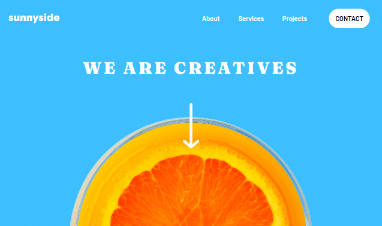

# Frontend Mentor - Sunnyside agency landing page solution

This is a solution to the [Sunnyside agency landing page challenge on Frontend Mentor](https://www.frontendmentor.io/challenges/sunnyside-agency-landing-page-7yVs3B6ef). Frontend Mentor challenges help you improve your coding skills by building realistic projects.

### Links
- Live Site URL: [https://divforscript.github.io/Agency-landing-page/](https://divforscript.github.io/Agency-landing-page/)

### Screenshot

### References
- https://www.youtube.com/watch?v=DSK6lsCvEog&ab_channel=TechnoSunita
- https://developer.mozilla.org/en-US/docs/Web/CSS/text-decoration
- https://tailwindcss.com/docs/responsive-design
- https://www.youtube.com/watch?v=xN1-2p06Urc&ab_channel=Philomatics
- https://www.youtube.com/watch?v=2IV08sP9m3U&ab_channel=Coding2GO

### Author
- Dayvid Ramos